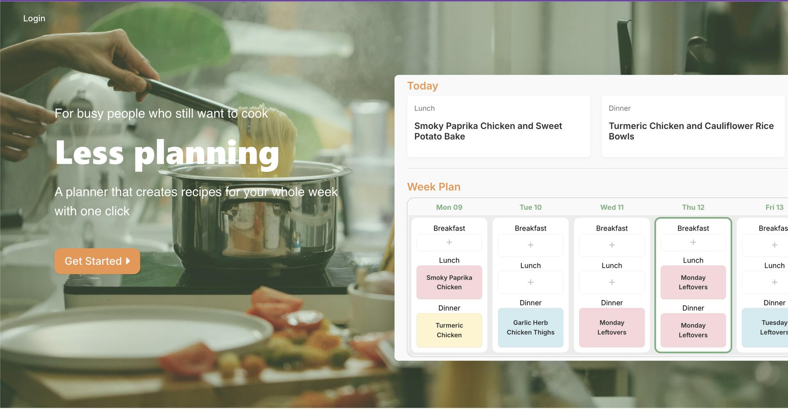
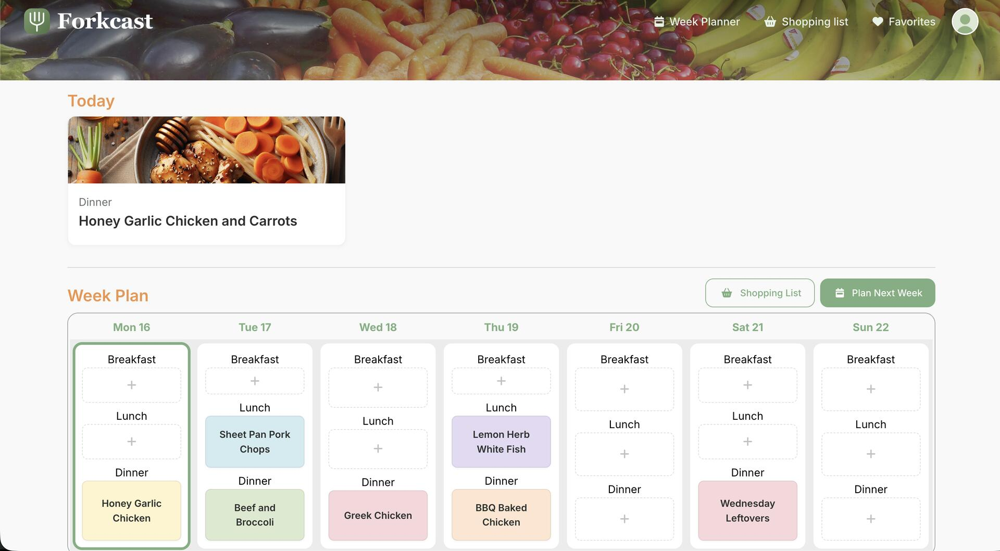
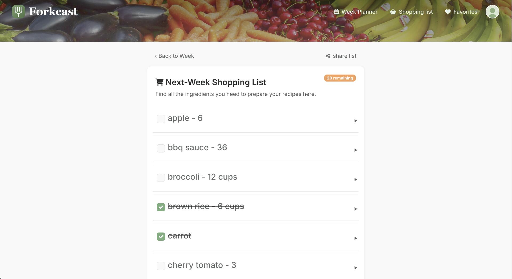

# 🍽️ Forkcast

🌐 [reciplan.org](https://reciplan.org)

---

## About

Originally Reciplan; we felt that Forkcast matches our identity better (fork, as in "what's for dinner?" meets forecast, as in planning your week ahead). Forkcast is a meal planning web app designed to make weekly cooking simple and stress-free. Users save their ingredient preferences and dietary restrictions, create weekly meals based on portions, and generate shopping lists automatically. Whether you're cooking for one or feeding a family, Forkcast helps you spend less time deciding what to eat and more time enjoying it. Built with Ruby on Rails, it's a fast, modern, and easy-to-use tool for everyday meal prep.

---

## Vision

With the overwhelming amount of recipes available on the web and on social media, planning what to make at home can be a lengthy task- especially for students and workers, those with dietary restrictions or allergies, and busy families. We wanted to build an easy, modern planning experience with simple meals that even beginners at cooking can enjoy. 

---

## ✅ Current Features
- Generate recipes based on preferences
- Save recipes to a personal favorites collection
- Build weekly meal plans
- Auto-generate shopping lists from combined ingredients of meal plans
  
---

## How to Use the App
1. Create an Account

-Visit reciplan.org and click Sign Up
-Enter your name, email, and password to create your account
-Already have an account? Click Log In to get started
-Enter your dietary restrictions

2. Build a Weekly Meal Plan

*First time users- choose the meals you'd like Forkcast to generate a recipe for and specify the number of portions you'd like to make and click   Generate Week
-Check out the recipes Forkcast has planned for you and make any changes you'd like
  1. reassign recipes to other meals or days by clicking and dragging,
  2. click on the day to see each meal
       -regenerate recipes you'd like to change
       -flip the recipe card to get a quick view of the ingredients
       -view the recipe to see the details: recipe image, ingredients, directions on how to make it       

Your plan will be automatically saved, so it'll be waiting for you every time you log in

3. Generate a Shopping List

Once your meal plan is ready, view your Shopping List for the next week's plan.
Reciplan will automatically compile all the ingredients you need for the week.
Review the list, check off items you already have, and take it with you to the store.
You can view the list on your mobile davice and share it with others via the share button.

4. Save Recipes to Favorites

If there are recipes you liked, click the ♡ Favorite button on any recipe.
Access all your saved recipes anytime under Favorites.
Use your favorites as a quick reference when building future meal plans.

---

## Screenshots

| Landing Page | Week Planner | Shopping List |
|---|---|---|
|  |  |  |

---

This project is private and maintained by the Forkcast team. All rights reserved.
